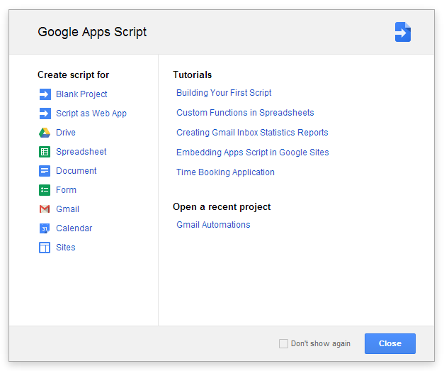
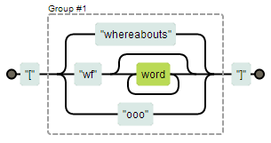
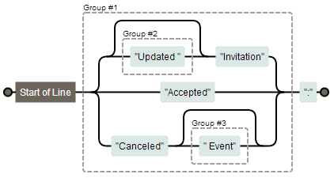
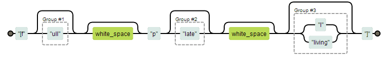
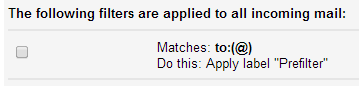
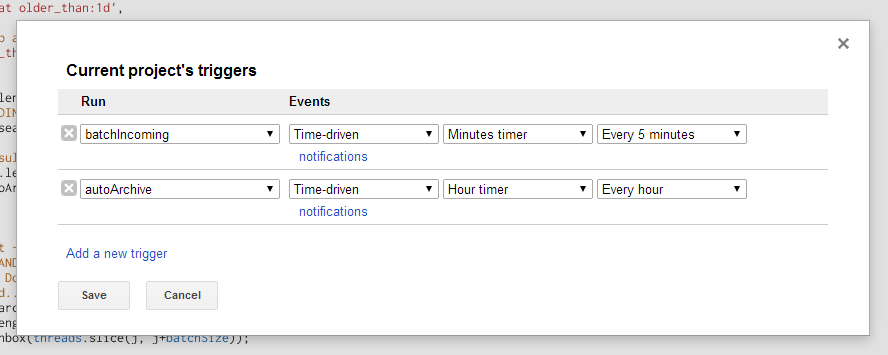

Originally written in June, 2014 by [Taylor Smith][TSMITH] for
[FourWord][FOURWORD], the blog of [Four Kitchens][4K]. See the full script
on [GitHub][REPO].

# Rescuing Myself from the Email Monster with JavaScript

We here at [Four Kitchens][4K] do love us some email.
Last week, I self-awarded a prize for having achieved 4,000 unread items in my
inbox, with another 3,000 read items sitting in my inbox for no reason. I could
keep going for the record, but I thought I'd attempt to use nerdiness to take
better control.

(Ultimately, it's a chore that simply has to be done, but maybe it can be easier.)

## Filters feel limited

I came to Gmail from Exchange; Filters have always seemed less powerful than Rules.

My gripes with Gmail Filters:

- Search is limited, seemingly, to word and number characters; special characters
  have no effect in searches, so I can't isolate "**\[** category **\]**" strings
  we use in subject lines.
- Complex groups of boolean logic have a tendency to produce imprecise results
  and there's no way to have "additional criteria" (even if multiple fields are
  used in the advanced search/filter builder, they're flatted into a single query)
- Other header information or metadata can't be used in the search criteria
  (like mailed-by to help weed out notifications "from" a user sent on their
  behalf by another service)
- Filters cannot be run on sent mail (for the purposes of auto-labeling)
- Filters cannot be run on a delay
- No regular expression matching

## Ta-Daa! [Gmail can be scripted][GMAIL] with JavaScript!

Checkout [Google Apps Script][GSCRIPT] and create a new blank project.



This is just JavaScript, but it runs server-side within Google Apps and can be
run on regular intervals or on specific triggers. You do not have to be logged
in with a window open to make this work!

### Step 1: Migrate Filters to JavaScript for More Power

**Goal:** Label _everything_, both incoming and outgoing. Additionally, some theads
are starred, marked as `/(un)?(important|read)/`, or immediately auto-archived.

``` js
function autoTagMessages(thread, index, threads) {
  var msg     = thread.getMessages()[0],
      subject = thread.getFirstMessageSubject(),
      to      = [msg.getTo(), msg.getCc()].join(', '),
      from    = msg.getFrom(),
      any     = [to, from].join(', ');
```

A new function is created for tagging messages. I compile a list of useful
variables and then move straight to categorizing:

**Timely Messages** generally require direct action, quickly. They are added to
the label '~/Announcements' by [`thread.addLabel()`][ADDLABEL] and also starred
using [`message.star()`][ADDSTAR].

_Gotchas:_
- The `addLabel()` function requires a Label object, not a string. Such
  an object can be obtaind using [`GmailApp.getUserLabelByName()`][GETLABEL].
  - Be sure to include 'parent/child' if your labels are hierarchical. (In this
    case, 'Announcements' is a child of '~').
- When using `string.match()`, be sure to add the `i` flag at the end of the
  pattern to ignore case, since authors may be inconsistent with case.
- If you see an error like `Cannot retrieve (line X, file "Code")` where X is a
  line containing a `getUserLabelByName` call, the most likely cause is that
  [Gmail couldn't find that label][LABELERROR].


``` js
  // Immediate To-Do Items
  if (subject.match(/\[timely\]/i) !== null) {
    msg.star();
    thread.addLabel( GmailApp.getUserLabelByName("~/Announcements") );
  }
```

**Whereabouts** emails are generally uninteresting since I work remotely most of
the time. They're all flagged as '~/Whereabouts' and, if they don't appear to
indicate that the sender will be unavailable, they are archived immediately:

``` js
  // Whereabouts Info (except stuff I don't care about)
  if (subject.match(/\[(whereabouts|wf\w*|ooo)\]/i) !== null) {
    thread.addLabel( GmailApp.getUserLabelByName("~/Whereabouts") );

    // Most of this is just "I'm working at home today", but this may be
    // a poorly-imagined idea... We'll see...
    if (subject.match(/(ooo|offline|unavailable|errands)/i) === null) {
      thread.moveToArchive();
    }
  }
```

_Regex on line 2 [visualized][RXWFH]:_



**Google Calendar** emails can be identified by what the subject line starts with:

``` js
  // Google Calendar Stuff
  if (subject.match(/^((Updated )?Invitation|Accepted|Canceled( Event)?)\:/) !== null) {
    thread.addLabel( GmailApp.getUserLabelByName("~/Calendaring") ).markUnimportant();
  }
```

_Regex [visualized][RXGCAL]:_



**Client** emails get sorted as well. We're a little lax in the formatting of
those tags, but regex makes that easier:

``` js
  else if (any.indexOf('fullplateliving.org') > -1 || subject.match(/\[f(ull)?\s?p(late)?\s?(l|living)?\]/i)) {
    thread.addLabel( GmailApp.getUserLabelByName("#/Full Plate Living") );
  }
```

_Regex [visualized][RXFPL]:_



This matches `[fpl]`, `[full plate]`, `[full plate living]`, `[fullplateliving]`,
and various others, as well as any email sent to/from `@fullplateliving.org`.

**In general,** the function contains three pieces:

- `If` statements testing timeliness or general discussion topics
- `If/else` statements testing for one of any application notification (Google
  Calendar, GitHub, JIRA, Notable, etc.) since a thread won't be from multiple
- `If/else` statements testing for one of any client name, since a thread is
  unlikely to pertain to multiple clients directly, although I may change this.

This allows a thread to end up with multiple labels at the expense of running a
little slower, but the load is reduced by being conservative with the triggers
(Step 3).

### Step 2: Script Email Expirations

My second function will archive threads that have dated out. Since the
`autoTagMessages()` function has nearly everything categorized, I'll base
retention and expiration off of labels, thread ages, and whether or not
the thread is read. This can be done by executing Gmail searches
programmatically using [`GmailApp.search()`][SEARCH].

Set up the searches as standard search queries:

``` js
  // Archive anything matching these searches
  var searches = [
    // General Stuff:
    'in:inbox label:~-whereabouts older_than:1d', // Highly timely
    'in:inbox label:~-calendaring older_than:3d', // Shows in Google Calendar
    '(in:inbox label:~-watercooler) AND ((is:read older_than:7d) OR (is:unread older_than:21d))',
    '(in:inbox label:~-announcements) AND ((is:read older_than:14d) OR (is:unread older_than:1m))',

    // Services Updates (timely; probably seen in-application)
    '(in:inbox) AND (label:~-jira OR label:~-notable OR label:~-harvest) AND ((is:read older_than:1d) OR (is:unread older_than:3d))',
    'in:inbox label:~-hipchat older_than:1d',

    // Catch all, don't keep anything stale:
    'in:inbox is:read older_than:2m'
  ];
```

Then run the searches and, in batches of 100 (`batchSize`), archive the resulting threads:

``` js
  for (i = 0; i < searches.length; i++) {
    // Run the search, EXLUDING anything that is starred:
    var threads = GmailApp.search(searches[i] + ' AND (-is:starred)');

    // Batch through the results to archive:
    for (j = 0; j < threads.length; j+=batchSize) {
      GmailApp.moveThreadsToArchive(threads.slice(j, j+batchSize));
    }
  }
```

_Gotchas:_ That `AND (-is:starred)` at the end of the search string doesn't
always work. Sometimes threads with starred messages are archived anyway. But
there is a way to fix that:

``` js
  var threads = GmailApp.search('-in:inbox is:starred');
  for (k = 0; k < threads.length; k+=batchSize) {
    GmailApp.moveThreadsToInbox(threads.slice(j, j+batchSize));
  }
```

_(I didn't say it was a graceful way...)_

### Step 3: Setup Triggers (like Cron for your inbox)

Now I have two functions:

1. `autoTagMessage()` - given a thread, label it appropriately.
2. `autoArchive()` - search for email that can be archived and do so.

#### Trigger `autoTagMessage` hourly on new email only

Google Apps Scripts can be triggered routinely, but unlike Outlook, there is no
'run as a message is received' option. [This can be emulated by][NEWEMAILMETHOD]:

- having Gmail filters assign one label to every incoming email, and then
- processing all messages in that label on a regular basis (5 minutes).

I assign the "Prefilter" label to all incoming messages by matching against
having an `@` in the `to` field. All other filters were exported and deleted.
Using the Label settings, "Prefilter" can be hidden from your inbox view so you
don't see it.



**Unexpected benefit:** I noticed that this "Prefilter" label is applied to all
outbound email as well (perhaps because it matches only against the `to` field),
allowing messages I send to be auto-labeled with no additional work!

Then, in a new function, I get those threads and tag them:

``` js
function batchIncoming() {
  GmailApp.getUserLabelByName("Prefilter").getThreads().forEach(autoTagMessages);
}
```

Next, amend `autoTagMessages()` to remove that label, and, if a thread has
multiple messages, abort. This will prevent re-labeling an entire thread for
any new messages in it (which would only be annoying in the case that a message
is starred; for example, replies to a `[timely]` thread would be starred
otherwise).

``` js
  thread.removeLabel( GmailApp.getUserLabelByName("Prefilter") );
  if (thread.getMessageCount() > 1) { return; }

```

Now I have two functions that can be run on a regular basis, so let's do so.
Under the "Resources" menu, click "Current project's triggers" and add these:



- `autoArchive()` can run hourly (or less frequently, honestly).
- `batchIncoming()` must run very frequently. I chose 5 minutes instead of 1 so
  that it wouldn't start again before the last execution has finished.
  - Google Apps Scripts will timeout and abort at five minutes, although I
    haven't hit that limitation.

## Declare a Reset, then Profit

Be sure to warn folks when you're about to purge a few thousand threads from your
inbox. Then sit back, _keep up with what you can_ using the auto-labeling help
you've built, and let Google Apps Scripts help you.

## Next Steps

I'm still working to:

1. Find an efficient way to filter threads with starred messages out of a
   `GmailApp.search()` result, so that I don't have to do that stupid "un-archive
   any starred threads" maneuver in `autoArchive()`. There is a method
   [`thread.hasStarredMessages()`][HASSTARS], but using that would require iterating
   over each thread in the result-set, which seems expensive for an otherwise
   batched process.

## Additional Reading

- [Create time-based Gmail filters with Google Apps Script][TIMEBASEDFILTERS]
- [Awesome Things You Can Do With Google Scripts][USEFULSCRIPTS]

[TSMITH]: http://www.tsmithcreative.com/
[FOURWORD]: http://fourword.fourkitchens.com/
[4K]: http://fourkitchens.com/
[REPO]: https://github.com/tsmith512/blogpost-email
[GMAIL]: https://developers.google.com/apps-script/reference/gmail/
[GSCRIPT]: http://www.google.com/script/start/
[ADDLABEL]: https://developers.google.com/apps-script/reference/gmail/gmail-thread#addLabel(GmailLabel)
[ADDSTAR]: https://developers.google.com/apps-script/reference/gmail/gmail-message#star()
[GETLABEL]: https://developers.google.com/apps-script/reference/gmail/gmail-app#getUserLabelByName(String)
[LABELERROR]: http://stackoverflow.com/questions/15688106/google-script-cannot-retrieve-line-9-file-code
[RXWFH]: http://www.regexper.com/#%2F%5C%5B(whereabouts%7Cwf%5Cw*%7Cooo)%5C%5D%2Fi
[RXGCAL]: http://www.regexper.com/#%2F%5E((Updated%20)%3FInvitation%7CAccepted%7CCanceled(%20Event)%3F)%5C%3A%2F
[RXFPL]: http://www.regexper.com/#%2F%5C%5Bf(ull)%3F%5Cs%3Fp(late)%3F%5Cs%3F(l%7Cliving)%3F%5C%5D%2Fi
[SEARCH]: https://developers.google.com/apps-script/reference/gmail/gmail-app#search(String)
[NEWEMAILMETHOD]: http://stackoverflow.com/a/16932138
[HASSTARS]: https://developers.google.com/apps-script/reference/gmail/gmail-thread#hasStarredMessages()
[TIMEBASEDFILTERS]: http://www.johneday.com/422/time-based-gmail-filters-with-google-apps-script
[USEFULSCRIPTS]: http://www.labnol.org/internet/google-scripts/28281/
